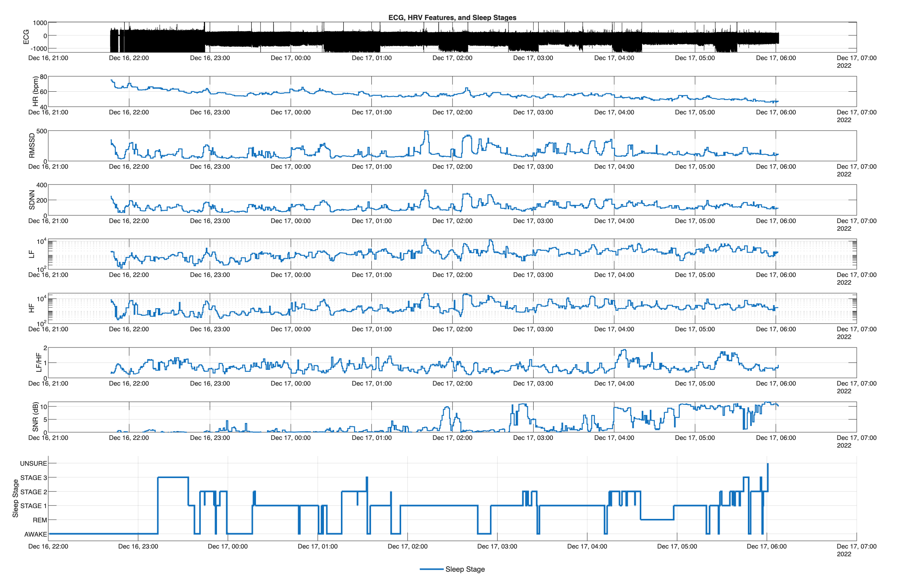

# ECG Feature Extraction and Visualization (MATLAB)

This repository contains a MATLAB (2025b-compatible) pipeline for loading raw
ECG data from EDF files, extracting ECG and HRV features on a per-epoch basis,
and visualizing both the raw signal and derived features over time.

The implementation is designed to be transparent, modular, and aligned with
common Python/NeuroKit-style ECG processing practices.

---

## Features Extracted

Per epoch (user-defined window length), the pipeline computes:

- Mean heart rate (HR)
- Maximum and minimum HR
- HRV (RMSSD)
- SDNN
- LF power (0.04–0.15 Hz)
- HF power (0.15–0.40 Hz)
- LF/HF ratio
- Signal-to-noise ratio (SNR, dB)

All features are derived from windowed ECG signals using physiologically
constrained peak detection and robust filtering.

---

## Repository Structure

```text
.
├── main.m
└── utils/
    ├── load_ecg_raw.m
    ├── get_ecg_features.m
    └── plot_ecg_features_over_time.m  
```
---

## MATLAB Version and Toolboxes

**Tested with:**
- MATLAB **R2025b**

**Required Toolboxes:**
- Signal Processing Toolbox  
  (for `butter`, `filtfilt`, `pwelch`, `findpeaks`)

**Built-in MATLAB Functions Used:**
- `edfread`, `edfinfo` (EDF file support)
- `findpeaks`
- `pwelch`
- `butter`, `filtfilt`
- `interp1`
- `smoothdata`
- `zscore`

No external toolboxes or third-party libraries are required.

---

## Example Output



**Figure 1.** Raw ECG waveform and derived ECG features (HR, HRV, LF/HF, SNR)
computed on fixed-length epochs and visualized as synchronized time series.

---

## Usage

### 1. Add utilities to MATLAB path
```matlab
addpath(fullfile(pwd, 'utils'));
