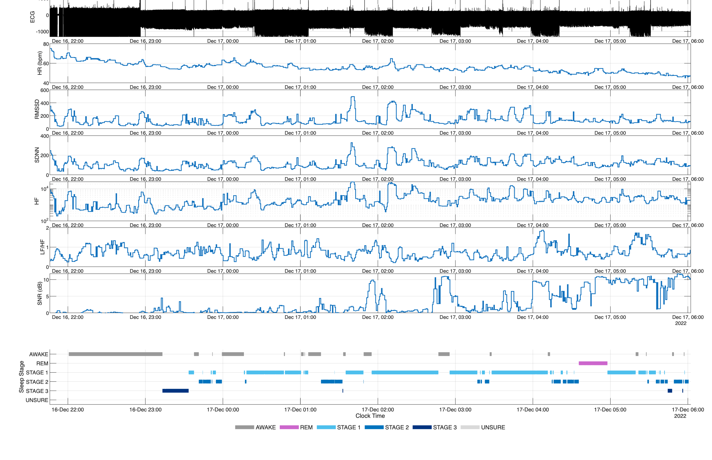
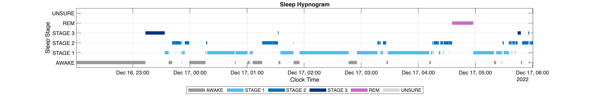
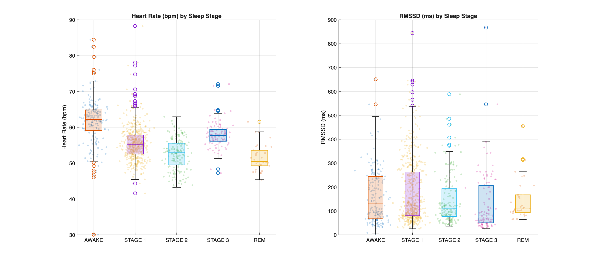
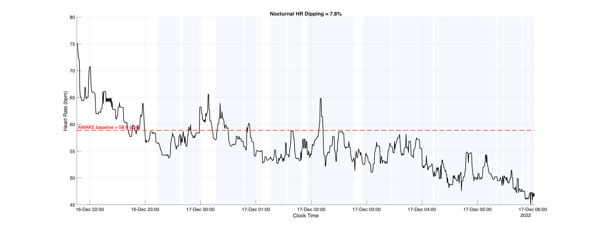

# ECG Feature Extraction and Visualization (MATLAB)

This repository contains a MATLAB (2025b-compatible) pipeline for loading raw
ECG data from EDF files, extracting ECG and HRV features on a per-epoch basis,
and visualizing both the raw signal and derived features over time.

The implementation is designed to be transparent, modular, and aligned with
common Python/NeuroKit-style ECG processing practices.

---

## Features Extracted

Per epoch (user-defined window length), the pipeline computes:

- Mean heart rate (HR)
- Maximum and minimum HR
- HRV (RMSSD)
- SDNN
- LF power (0.04–0.15 Hz)
- HF power (0.15–0.40 Hz)
- LF/HF ratio
- Signal-to-noise ratio (SNR, dB)

All features are derived from windowed ECG signals using physiologically
constrained peak detection and robust filtering.

---

## Repository Structure

```text
.
├── main.m
└── utils/
    ├── load_ecg_raw.m
    ├── load_sleep_hypnogram.m
    ├── get_ecg_features.m
    ├── plot_sleep_hypnogram.m
    ├── plot_hr_hrv_by_stage.m
    └── plot_ecg_features_over_time.m
```
---

## MATLAB Version and Toolboxes

**Tested with:**
- MATLAB **R2025b**

**Required Toolboxes:**
- Signal Processing Toolbox  
  (for `butter`, `filtfilt`, `pwelch`, `findpeaks`)

**Built-in MATLAB Functions Used:**
- `edfread`, `edfinfo` (EDF file support)
- `findpeaks`
- `pwelch`
- `butter`, `filtfilt`
- `interp1`
- `smoothdata`
- `zscore`

No external toolboxes or third-party libraries are required.

---

## Example Output

The pipeline generates a set of complementary figures that summarize raw ECG,
derived autonomic features, sleep staging, and nocturnal dipping behavior.

---

### Figure 1. ECG, HRV Features, and Sleep Stages (Time-Resolved)



**Figure 1.**  
Raw ECG waveform (top) and epoch-level autonomic features (HR, RMSSD, SDNN,
HF power, LF/HF ratio, and SNR) computed over fixed-length windows and displayed
as synchronized time series.

The bottom panel shows an MWT-aware hypnogram, where "?" epochs are treated
as baseline periods and subsequent epochs represent MWT trials with sleep
or wake stages (AWAKE, STAGE 1–3, REM, UNSURE).

This figure provides a holistic overview of signal quality, autonomic dynamics,
and trial structure across the full recording.

---

### Figure 2. Block-wise Heart Rate Change During MWT



**Figure 2.**  
Distribution of heart rate (left) and HRV (RMSSD; right) across sleep stages.
Each point represents an epoch-level estimate, overlaid with boxplots to
summarize central tendency and variability.

These plots enable stage-resolved autonomic comparisons (e.g., wake vs NREM vs
REM) and are suitable for group-level aggregation in downstream analyses.

---


### Figure 3. MWT Hypnogram (Baseline vs Trials)



**Figure 3.**  
MWT hypnogram derived from PSG annotations and plotted as a stage-resolved
timeline. Baseline periods ("?") are explicitly labeled as BASELINE, while
trial periods are shown by sleep stage.

This visualization highlights the block structure of the MWT protocol,
where baseline segments precede each trial.

### Figure 4. Heart Rate and HRV by MWT Stage



**Figure 4.**  

Distribution of heart rate (left) and HRV (RMSSD; right) across MWT stages,
including BASELINE, AWAKE, and sleep stages. Each point represents an
epoch-level estimate, overlaid with boxplots to summarize central tendency and
variability.

These plots support stage-resolved autonomic comparisons and are suitable for
within-subject or group-level analyses.


## Methodological Notes (MWT-Specific)

- Baseline periods are identified using `"?"` annotations in the hypnogram.
- Each baseline block is paired exclusively with the **immediately following MWT trial**, yielding block-wise heart rate (HR) change estimates.
- Baseline–trial comparisons are strictly confined within each block and never span multiple baseline–trial cycles, ensuring temporal and physiological validity.
- This block-wise design reflects standard Maintenance of Wakefulness Test (MWT) protocols, which consist of repeated quiet-rest baselines followed by nap opportunities.

---

## Usage

### 1. Add utilities to MATLAB path
```matlab
addpath(fullfile(pwd, 'utils'));
