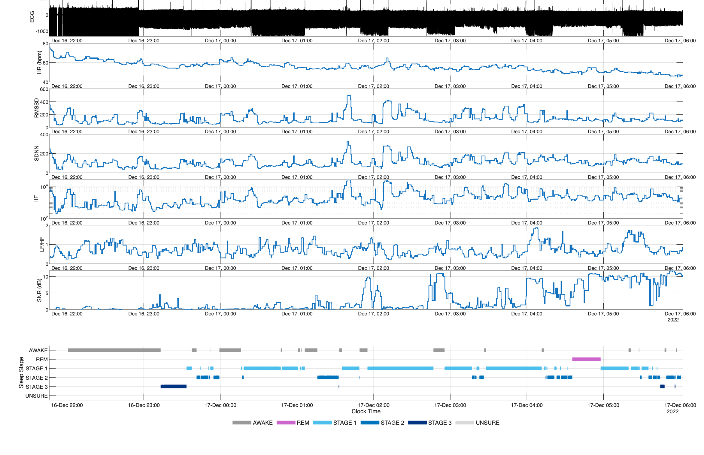
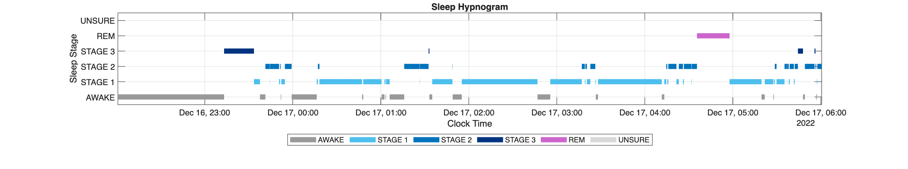
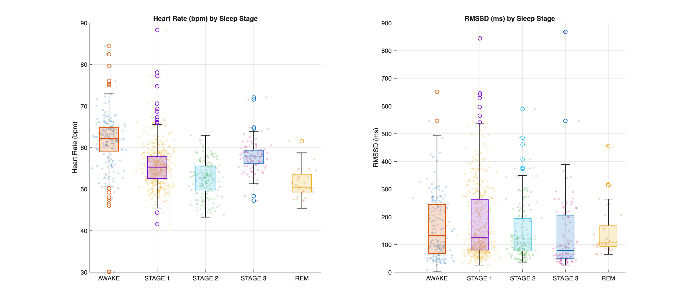
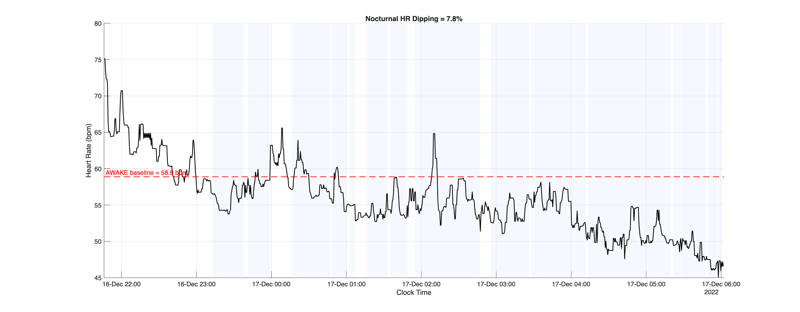

# ECG Feature Extraction and Visualization (MATLAB)

A MATLAB (R2025b-compatible) pipeline for loading raw ECG data from EDF files,
extracting ECG and HRV features on a per-epoch basis, and visualizing both the
raw signal and derived features over time.

The implementation is designed to be transparent, modular, and aligned with
common Python/NeuroKit-style ECG processing practices.

---

## Features Extracted

Per epoch (user-defined window length), the pipeline computes:

- Mean heart rate (HR)
- Maximum and minimum HR
- HRV (RMSSD)
- SDNN
- LF power (0.04–0.15 Hz)
- HF power (0.15–0.40 Hz)
- LF/HF ratio
- Signal-to-noise ratio (SNR, dB)

All features are derived from windowed ECG signals using physiologically
constrained peak detection and robust filtering.

---

## Repository Structure

```text
.
├── main.m
├── assets/
│   ├── Figure1.png
│   ├── Figure2.png
│   ├── Figure3.png
│   └── Figure4.png
└── utils/
    ├── load_ecg_raw.m
    ├── load_sleep_hypnogram.m
    ├── load_sleep_stages.m
    ├── get_ecg_features.m
    ├── find_contiguous_blocks.m
    ├── debug_plot_ecg_peaks.m
    ├── plot_sleep_hypnogram.m
    ├── plot_hr_hrv_by_stage.m
    └── plot_ecg_features_over_time.m
```

---

## MATLAB Version and Toolboxes

**Tested with:**
- MATLAB **R2025b**

**Required Toolboxes:**
- Signal Processing Toolbox  
  (for `butter`, `filtfilt`, `pwelch`, `findpeaks`)

**Built-in MATLAB Functions Used:**
- `edfread`, `edfinfo` (EDF file support)
- `findpeaks`, `pwelch`, `butter`, `filtfilt`
- `interp1`, `smoothdata`

No external toolboxes or third-party libraries are required beyond the Signal
Processing Toolbox. All other utilities (`zscore_safe`, `find_contiguous_blocks`)
are implemented locally.

---

## Example Output

The pipeline generates a set of complementary figures that summarize raw ECG,
derived autonomic features, sleep staging, and nocturnal dipping behaviour.

---

### Figure 1. ECG, HRV Features, and Sleep Stages (Time-Resolved)



**Figure 1.**  
Raw ECG waveform (top) and epoch-level autonomic features (HR, RMSSD, SDNN,
HF power, LF/HF ratio, and SNR) computed over fixed-length windows and displayed
as synchronized time series.

The bottom panel shows an MWT-aware hypnogram, where `"?"` epochs are treated
as baseline periods and subsequent epochs represent MWT trials with sleep
or wake stages (AWAKE, STAGE 1–3, REM, UNSURE).

---

### Figure 2. Block-wise Heart Rate Change During MWT



**Figure 2.**  
Distribution of heart rate (left) and HRV (RMSSD; right) across sleep stages.
Each point represents an epoch-level estimate, overlaid with boxplots to
summarize central tendency and variability.

---

### Figure 3. MWT Hypnogram (Baseline vs Trials)



**Figure 3.**  
MWT hypnogram derived from PSG annotations and plotted as a stage-resolved
timeline. Baseline periods (`"?"`) are explicitly labelled as BASELINE, while
trial periods are shown by sleep stage.

---

### Figure 4. Heart Rate and HRV by MWT Stage



**Figure 4.**  
Distribution of heart rate (left) and HRV (RMSSD; right) across MWT stages,
including BASELINE, AWAKE, and sleep stages. Each point is an epoch-level
estimate, overlaid with boxplots summarizing central tendency and variability.

---

## Methodological Notes (MWT-Specific)

- Baseline periods are identified using `"?"` annotations in the hypnogram.
- Each baseline block is paired exclusively with the **immediately following MWT trial**, yielding block-wise HR change estimates.
- Baseline–trial comparisons are strictly confined within each block and never span multiple baseline–trial cycles, ensuring temporal and physiological validity.
- This block-wise design reflects standard Maintenance of Wakefulness Test (MWT) protocols, which consist of repeated quiet-rest baselines followed by nap opportunities.

---

## Usage

### 1. Set paths in `main.m`

Open `main.m` and update the two path variables to point to your EDF and
hypnogram files:

```matlab
edf_path = "path/to/your/recording.edf";
h_path   = "path/to/your/hypnogram.txt";
```

The subject ID is derived automatically from the first four characters of the
EDF filename.

### 2. Add utilities to the MATLAB path

```matlab
addpath(fullfile(pwd, 'utils'));
```

### 3. Run the pipeline

```matlab
run main.m
```

This will:
1. Load the raw ECG signal and sleep stage annotations
2. Run peak-detection debugging on a randomly selected epoch
3. Generate and save all four figures to `figures/<subject_id>/`

---

## Contact

For questions or feedback: murat.kucukosmanoglu@dprime.ai
